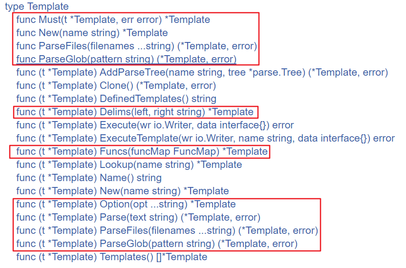

https://www.cnblogs.com/f-ck-need-u/p/10035768.html

这里就是template的源码解析了

我们首先来看入门示例

```go
package main

import (
	"html/template"
	"os"
)

type Person struct {
	Name string
	Age    int
}

func main() {
	p := Person{"longshuai", 23}
	tmpl, err := template.New("test").Parse("Name: {{.Name}}, Age: {{.Age}}")
	if err != nil {
		panic(err)
	}
	err = tmpl.Execute(os.Stdout, p)
	if err != nil {
		panic(err)
	}
	fmt.Println(tmpl)
}
```
上面定义了一个Person结构，有两个**大写字母开头**(意味着这俩字段是导出的)的字段Name和Age。然后main()中创建了Person的实例对象p。

紧接着使用template.New()函数创建了一个空Template实例(对象)，然后通过这个template实例调用Parse()方法，Parse()方法用来解析、评估模板中需要执行的action，其中需要评估的部分都使用`{{}}`包围，并将评估后(解析后)的结果赋值给tmpl。

最后调用Execute()方法，该方法将数据对象Person的实例p应用到已经解析的tmpl模板，最后将整个应用合并后的结果输出到os.Stdout。

上面的示例很简单，两个注意点：

1. 流程：构建模板对象New()-->解析数据Parse()-->应用合并Execute()
2. Parse()解析的对象中包含了{{}}，其中使用了点(.)，{{.Name}}代表Execute()第二个参数p对象的Name字段，同理{{.Age}}

也就是说，{{.}}代表的是要应用的对象，类似于java/c++中的this，python/perl中的self。

更通用地，{{.}}表示的是所处作用域的当前对象，而不仅仅只代表Execute()中的第二个参数对象。例如，本示例中{{.}}代表顶级作用域的对象p，如果Parse()中还有嵌套的作用域range，则{{.}}代表range迭代到的每个元素对象。如果了解perl语言，{{.}}可以理解为默认变量$_。

### 模板关联



上图中使用红色框线框起来一部分返回值是`\*Template`的函数、方法。对于函数，它们返回一个Template实例(假设为t)，对于使用t作为参数的Must()函数和那些框起来的Template方法，它们返回的`\*Template`其实是原始实例t。


这里其实我们需要自己主动去深入的看源码。 因为这里狠毒东西要去理解它

这里我觉得笔记其实没啥用  源码一层嵌套一层  然后我们常用的 parse 这里会涉及到具体的文本内容解析

比如说 匹配左右括号等等

这里要自己去看  看了就懂了
